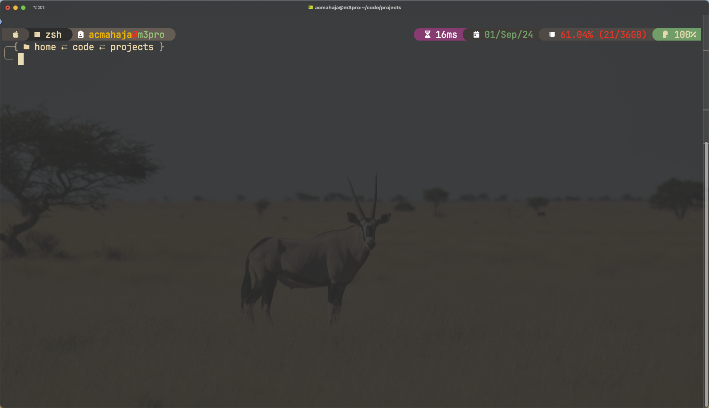
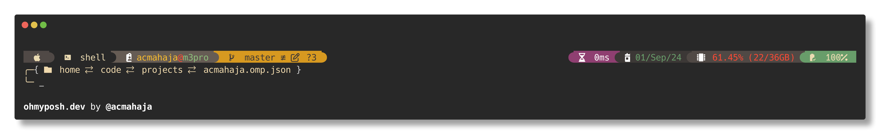

# Gruvbox Theme for Oh My Posh



A warm and cozy theme for [Oh My Posh](https://ohmyposh.dev/), inspired by the [Gruvbox](https://github.com/morhetz/gruvbox) color scheme.

## Preview


## Installation

1. Ensure you have [Oh My Posh](https://ohmyposh.dev/) installed.
2. Download `acmahaja.omp.json` file (or whatever you've named your theme file).
3. Add the following to your shell configuration file (e.g., `.bashrc`, `.zshrc`):

   ```shell
    eval "$(oh-my-posh init zsh --config 'https://raw.githubusercontent.com/acmahaja/acmahaja.omp.json/main/acmahaja.omp.json')"
   ```

   Replace `bash` with your shell of choice if different.

## Features

- Warm, earthy color palette based on Gruvbox
- Git status integration
- Current directory display
- Segements for Go, Python, Node.js and more to come

## Credits

- Inspired by the [Gruvbox](https://github.com/morhetz/gruvbox) color scheme
- Built for [Oh My Posh](https://ohmyposh.dev/)

## Contributing

Contributions are welcome! Please feel free to submit a Pull Request.

## Support

If you encounter any problems or have any questions, please open an issue in this repository.
